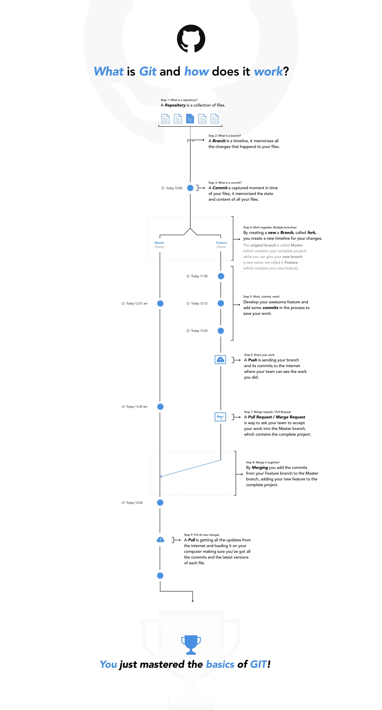

# Buy a Camel

## Learn the basics of git

**Why use git:**

Learning programming requires a lot of experimentation. But the feeling that you might break code that you wrote can hold you back from doing that. Luckily there is a great solution that let's you 'turn back time' and it's called git. Version control with git is your camel that let's you explore the desert without fear that you can't get back.

As an added bonus git allows you to collaborate with other programmers. You can merge your version of a program with a version of someone else.

Lastly git allows you to easily save your code in remote repositories hosted in the cloud on platforms like github, gitlab or bitbucket. That way the chance that you permanently lose your work is almost impossible.

## Overview:

- Install git on your system
- Learn how to use git
- Make an account on github
- Practice using git

#### Install git on your machine

[Follow the instructions for your OS here ](https://git-scm.com/book/en/v2/Getting-Started-Installing-Git)

#### Learn how to use git

- #### Coding train
For a great and fun tutorial checkout [this](https://www.youtube.com/playlist?list=PLRqwX-V7Uu6ZF9C0YMKuns9sLDzK6zoiV) playlist by the coding train (60 minutes). Explains what git is and how it's used in an accessible way.

- #### Learn Git in 20 minutes
For a shorter and windows specific introductions check out [this](https://www.youtube.com/watch?v=Y9XZQO1n_7c) video

#### Make an account on github

1. Go to [github.com](https://github.com/)
2. Sign up
3. Make your first repository
4. [Learn about SSH keys](https://help.github.com/articles/connecting-to-github-with-ssh/)
4. [Generate an SSH key and add it to your github account](https://help.github.com/articles/adding-a-new-ssh-key-to-your-github-account/#platform-mac)

#### Practice using git

You can use [this cheat sheet](https://services.github.com/on-demand/downloads/github-git-cheat-sheet.pdf) to help you

#### Challenges

##### Your first git repo and commit

Before you can start using git in your project you have to make a git repository. Initially this repository will contain only one branch: The master branch. This is the version of your code that should always work. Once you make files you can 'add' files you want to commit and them 'commit' them to your master branch. A commit is like making a snapshot of what the code looks like. You can easily go back to this moment in time when you screw up.

- [ ] Make a new git repository in your command line
- [ ] Make a html file in the same folder as your git repository
- [ ] Add the html file to staged files to be committed
- [ ] Commit the first version of your html file to your git repository

##### Your first branch and merge

The basic git workflow is to make your own branch for the feature you're making. On this branch you commit your changes. When your feature is complete you merge it back into the master branch. Branches are a great place to experiment with code. If you screw up you can just check out the master branch again and try again.

- [ ] Make a branch and give it a name
- [ ] Checkout this new branch
- [ ] Make some changes to the html file you created
- [ ] Add & Commit your changes on this branch
- [ ] Checkout your master branch
- [ ] Merge the branch you made into your master branch
- [ ] Delete the branch you just merged (keep your master branch)

##### Add a remote repository and push your branch

Remote repositories hosted in the cloud on platforms like github, gitlab or bitbucket can serve as backups and as places to collaborate with other programmers. You will now have two git repositories to manage - you local repository (the one you've been using) and the remote repository (the one on github). You can 'push' branches to add them to the remote repository. You can 'fetch' branches from the remote that you don't have locally or 'pull' the latest changes to a branch that you already have.

- [ ] Make a new repository on github
- [ ] Add a this github repository to your local git repository as a remote repository
- [ ] Push your master branch to your remote repository
- [ ] Make a new branch, make some changes to your html file
- [ ] Commit your changes on this branch
- [ ] Push this branch to your remote repository

##### Make pullrequest, merge and pull

Once your branch is in the remote repository, you can make a request to pull your changes into the master branch. Some people call this a merge request. A pullrequest is a moment where other people can have a look at the changes you're suggesting and give their comments and feedback. But you can first try working with a pullrequest yourself.

- [ ] Make a pullrequest on github to merge this branch into your master branch
- [ ] Merge your pullrequest
- [ ] Checkout your local master branch
- [ ] Pull the latest changes from your remote master branch to your local master branch

##### Clone someone else's work

Now that you know how to push and pull work you can start collaborating with others. An easy way to get started is to clone an existing repository from github. You basically get to copy people's code and use it for free! If you have something to add to their code you can make a pullrequest to the original repository.

- [ ] Find an awesome repository on github [(or how about this one?)](https://github.com/thedaviddias/Resources-Front-End-Beginner)
- [ ] Clone this repository to your local machine using git clone

##### Collaborating with a team

Platforms like github allow multiple users to collaborate on the same remote git repository. That means you can each push your branches to the remote repository and then later merge them into a shared branch.

- [ ] Create a repository for your group project
- [ ] Add a file POEM.md to your repository
- [ ] Go to settings
- [ ] Go to collaborators
- [ ] Add your team members to this repository
- [ ] As a team member - clone the repository
- [ ] Make a branch and give it your name, check it out
- [ ] Add and commit a verse to the poem
- [ ] Push the branch to the remote repository
- [ ] Make a pullrequest to merge your changes into the master branch
- [ ] Have your teammates review and comment on your poetry in the pullrequest
- [ ] Ask one of your teammates to merge the pullrequest

##### Visual Roadmap

