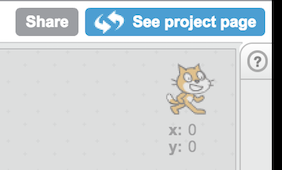
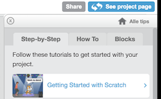

# *Chez la code*

## *Tasting menu*

The tasting menu is prepared especially for first time guests. Who have little to no programming experience. It is meant to give you a taste of what programming is like.

## How does this menu work

* The menu is divided into 3 main languages
  * *HTML / CSS*: Used for make websites
  * *Scratch*: Beginner friendly block based language used to make games, stories and much much more
  * *Javascript*: General purpose programming language  
* This menu lists stating off point, tools and challenges
* It up to *you* to find the solutions ( that's programming baby! ).
* Use google or ask a neighbour when you get stuck
* Have fun!

## Appetizers

As an appetizer write a "hello world" program. A hello world program is a program that produces the text "hello world!" when run.

##### HTML/CSS RAVIOLI
Write a hello world in HTML/CSS using thimble. Thimble is a an online editor with which you can learn to build websites.
* Go to https://thimble.mozilla.org/
* Click "start a project from scratch".
* Change the text on the page to "Hello world"

##### SEARED CAT MEDALLIONS

Write a hello world in Scratch
* Go to https://scratch.mit.edu/
* Click on "create" (at the top of the page)
* Find a block "say ... for ... secs" block (it's purple)
* Drag it to the scripts section on the right (big grey area).
* Click the block

##### JAVASCRIPT BRUSCHETTA

Write a hello world in Javascript try this tutorial http://do.co/2wSzgcj

* Use the javascript console in the chrome devtools
* Follow the tutorial ;)

## Main courses

##### HTML CSSOULET

**Challenges:**
- [ ] Find out what HTML is used for and what CSS is used for
- [ ] Find out what a HTML tag is
- [ ] Try adding an image to the page
- [ ] Make a link to your favourite website
- [ ] Try changing the color of the background of the page
- [ ] Try to centre the some text on your webpage
- [ ] Make a second page on your website and link to it from your first page
- [ ] What is a "class" and what can you use it for?
- [ ] Make the some text of your page change color when you hover over it

Good sources to use:

W3Schools: https://www.w3schools.com/  
MDN: https://developer.mozilla.org/

##### CATATOUILLE
Follow some scratch "Step-by-Step" tutorials. You can find by pressing the question mark in the scratch editor.

**Challenges** ( Or create something crazy that you think of yourself! )

- [ ] Make a cat that you can move using the arrow keys
- [ ] Make a mouse that disappears when the cat touches it
- [ ] Every time a mouse is caught a new mouse appears in a random location
- [ ] Make the mouse run away randomly (easy), from the cat (harder)
- [ ] Make a score variable (in data section)
- [ ] Make the score change by 1 every time you catch a mouse
- [ ] Animate the cat and mouse
- [ ] Compose your own music to play during the game
- [ ] Create a time limit of 30 seconds
- [ ] Create a high score variable that saves the highest score

##### JAVASCRIPT BOURGUIGNON
We are going to modify an existing javascript game. You can find it this url:

https://thimbleprojects.org/reinoptland/354076/

The first step is to press the "Remix" to get a version of the code for you to edit
